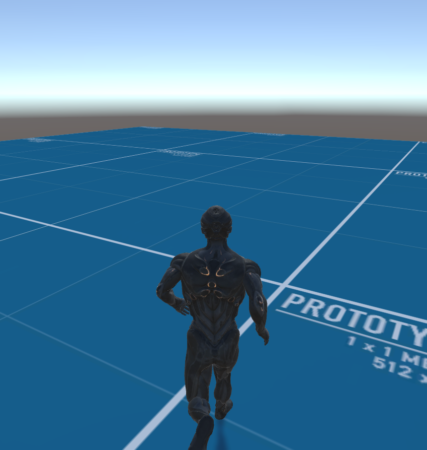
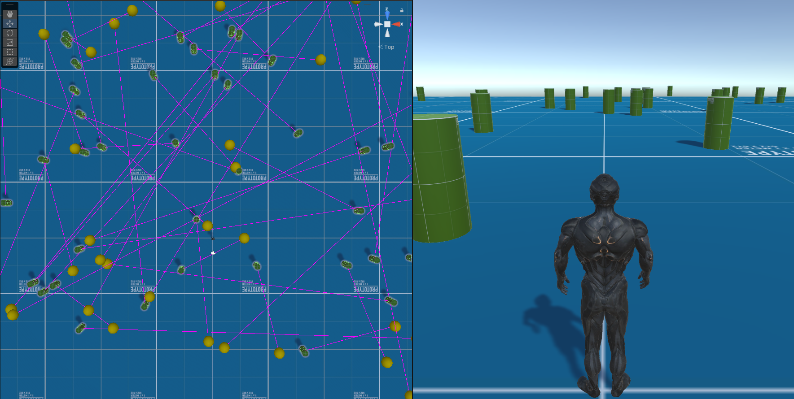
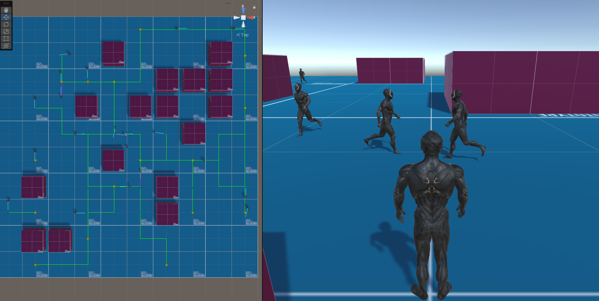

  <h3 align="center">Crowd Simulator</h3>

  

    A crowd simulation system that integrates core computer animation topics, like character animation, navigation and pathfinding (here: A*).
  

  
   

  

    
  

## 📋 <a name="table">Table of Contents</a>
1. 🤖 [Introduction](#introduction)
2. ⚙️ [How to run](#how-to-run)
3. 🏃‍♂️ [Locomotion](#locomotion)
4. 💥 [Collision Detection and Avoidance](#collision-detection)
5. 🗺️ [A* Pathfinding](#pathfinding) 

## <a name="introduction">🤖 Introduction</a>
Developed using Unity/C#, as part of the Computer Animation (CA) course. This project's goal is to teach students the application of core computer animation techniques in an easy and straightforward way, hence the use of Unity. The project is divided into 4 exercises, with each implemented in separate scenes. However, they are built incrementally on top of each other, meaning that each exercise takes advantage of its predecessor’s functionalities. 

- Exercise 1: Locomotion (**DONE**)
- Exercise 2: Collision Detection and Avoidance Between Agents (**DONE**)
- Exercise 3: Pathfinding (**DONE**)
- Exercise 4: Steering (**NOT-DONE**)

## <a name="how-to-run">⚙️ How to run</a>

**Prerequisites**

Make sure you have the following installed on your machine:
- [Unity](https://unity.com/) (Version: 2022.3.14f1 LTS)

**Running the project**
- Download and Open via the Unity Editor
- Run each scene separately from `./Assets/Scenes/`

## <a name="locomotion">🏃‍♂️ Locomotion </a>

**Animating the character**

For the first part, the goal is to create the core locomotion functionality of the main character. This
includes the import of various animations, the handling of the animation controller via a `locomotion blendtree`,
and some utility components to track the movements in-detail. The application is viewed
from a third-person perspective.
There are 2 types of camera orientations: `free` and `fixed`. On free orientation mode, when the
user moves and rotates the character, the camera follows the direction of the movement, looking at
the direction that the character is looking.
On fixed orientation mode, the camera is fixed on the scene’s forward direction, and doesn’t
change its angle whatever the character’s movement.
The keyboard commands for the Locomotion exercise are:

- WASD: Move character (Walk)
- Left-Shift: Enable running (while pressed)
- O: Toggle camera orientation (free/fixed)

Exercise 1: Locomotion|
:-------------------------:|
|

## <a name="collision-detection">💥 Collision Detection and Avoidance</a>

For the second exercise, a crowd of N agents (here: prop cylinders) are instantiated in random
positions, and are assigned random goals in the scene to move towards. When a goal is reached by an
agent, another random goal is assigned to that agent. The crowd is generated by a `CrowdGenerator` GameObject,
that instantiates the agents inside the limits of the moveable area. The agents hold the
scripts regarding their goals and paths on themselves.
These agents respond to collisions and avoid overlapping with the use of `Colliders` and `Rigidbodies`.

Exercise 2: Crowd and Avoidance|
:-------------------------:|
|

## <a name="pathfinding">🗺️ A* Pathfinding</a>

The goal of the third part of the project is to implement a pathfinding algorithm, namely A*. In this
part the `CrowdGenerator` GameObject instantiates other humanoid agents, to create a more visually
appealing result. (Note: Cylinders can still be used, by using the "Agent_Astar" cylinder prefab in
the Prefabs folder)

The two core components for this algorithm are the `Grid` and the `PathNode`. The
Grid component is responsible for creating a regular 2D grid on the X-Z plane (Y=0), while also
holding utility functions to be used by other components. PathNode only holds basic information,
like coordinates or costs, for each node of the pathfinding graph to be used later on.
The component that actually implements the A* algorithm is `Pathfinding`. By default, the cost of
moving to each adjacent node is set to 10, while the cost of moving diagonally to the next node is set
to 14 (arbitrary values). The agents have modified versions of their previous Agent and PathManager
components, to make use of the A* algorithm (using the algorithm to find a goal and their path
towards it, instead of getting a random goal and moving freely, in a straight line, to reach it). The
updated `PathManager_Astar` of these updated agents have a toggle option to enable/disable diagonal
movement (default: disabled).

Another GameObject introduced in this part is the `ObstacleManager`, which selects an "M" number
of obstacles to generate, and instantiates them randomly in the scene, occupying 1 grid-cell each.
These grid-cells are then marked as `non-walkable`, where the agents cannot be instantiated at first, or
move through them afterwards.

Exercise 3: A* Pathfinding|
:-------------------------:|
|
